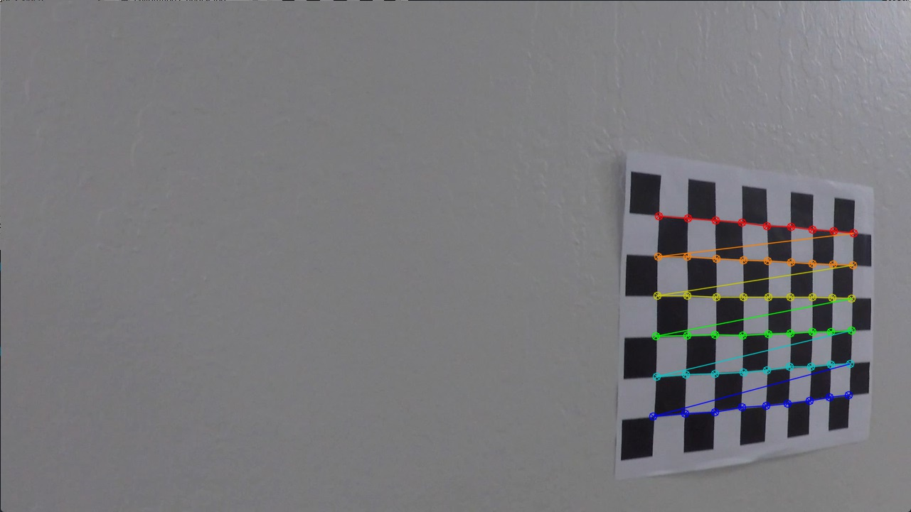
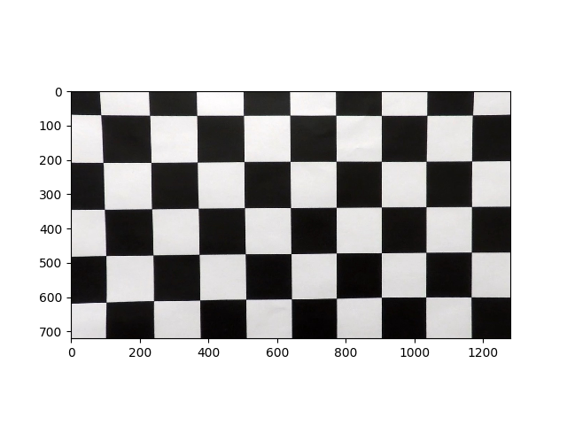

##Writeup for P4 Advanced Lane Line Detection

---

**Advanced Lane Finding Project**

The goals / steps of this project are the following:

* Compute the camera calibration matrix and distortion coefficients given a set of chessboard images.
* Apply a distortion correction to raw images.
* Use color transforms, gradients, etc., to create a thresholded binary image.
* Apply a perspective transform to rectify binary image ("birds-eye view").
* Detect lane pixels and fit to find the lane boundary.
* Determine the curvature of the lane and vehicle position with respect to center.
* Warp the detected lane boundaries back onto the original image.
* Output visual display of the lane boundaries and numerical estimation of lane curvature and vehicle position.

---

## [Rubric Points](https://review.udacity.com/#!/rubrics/571/view)
###Here I will consider the rubric points individually and describe how I addressed each point in my implementation.  

---
###Writeup / README

####1. Provide a Writeup / README that includes all the rubric points and how you addressed each one.  You can submit your writeup as markdown or pdf.  [Here](https://github.com/udacity/CarND-Advanced-Lane-Lines/blob/master/writeup_template.md) is a template writeup for this project you can use as a guide and a starting point.  

You're reading it!
###Camera Calibration

####1. Briefly state how you computed the camera matrix and distortion coefficients. Provide an example of a distortion corrected calibration image.

The code for this step is in the *main_script.py*, line 33-50. There it creates a new camera object of type *camera_util.Camera* with a method *calibrate_camera()* (line 41-105 within the *camera_util.py*). The method opens the camera calibration images with a configurable number of inner corners along the x and y axis. The steps within is pretty straigth forward, by using *findChessboardCorners()* to find corners. If corners are found, then they are added to a list of found corner coordinates. Do this for all calibration images, then feed all the found corners into the *calibrateCamera()* to compute the camera's transformation matrix and distortion coefficients.



The camera object also has *undistort_image()* method to apply the transformation and distortion coefficient to obtain the original undistorted image too, which will be used further in the pipeline. The figure below shows one of the calibration images after using this method.



###Pipeline (single images)

####1. Provide an example of a distortion-corrected image.
The following figure shows an undistorted test image.


####2. Describe how (and identify where in your code) you used color transforms, gradients or other methods to create a thresholded binary image.  Provide an example of a binary image result.

The *main_script.py* is the main code that runs the entire workflow. However, most of the image processing part isn't done here, but are done in *camera_util.py* which provides utility methods for manipulating camera images, and *lane_finder.py* which provides utility methods for detecting lane lines using various computer vision techniques.

The main method to find lane lines, including doing color transforms, gradient detection, etc to detect lines are done in *lane_finder.find_lane()* method (line 442). Within you will see at line 469 and 470 that the (undistorted) road image is passed to the *lane_finder._find_lane_by_gradient()* and *lane_finder._find_lane_by_hls()* methods to get binary images of the lane lines from gradient-based methods and from applying proper thresholds to HLS channels of the image, respectively.

The following figures show results from applying gradient-based methods and combining them together to highlight the lane lines.


The following figures show results from applying thresholds to HLS channels and combining them together to highlight the lane lines.


The following figure shows the final result from combining all (gradient / HLS) methods together, as well as applying region-of-interest mask to highlight the lane lines (*lane_finder.py*, line 471)


####3. Describe how (and identify where in your code) you performed a perspective transform and provide an example of a transformed image.

The perspective transformation is done in *lane_finder.py*, line 477. It actually calls a method of a camera object, *camera_util.get_top_view()*, line 115 to do this transformation. See the following figure for a top-viewed image of the lane lines.


Note that the perspective transformation matrix has been pre-computed since the camera object was first initialized (*camera_util.py*, line 35) using pre-configured source and destination points as follow.

```python
# source points in dash-cam perspective
SRC_POINTS = np.array([
            [265, 683],
            [560, 480],
            [729, 480],
            [1049, 683]],
            dtype=np.float32)

# destination points in top-view perspective
DST_POINTS = np.array([
            [400, 700],
            [400, 50],
            [860, 50],
            [860, 700]],
            dtype=np.float32)
```

####4. Describe how (and identify where in your code) you identified lane-line pixels and fit their positions with a polynomial?

Determining representative points for lane lines is done in *lane_finder.py*, line 480. It calls a method *_find_lane_by_convolution()* further which basically does the following steps

- Devide the image into smaller (9) segments and process each segment in a loop (line 312)
- Apply a convolution filter from left to right of each segment (line 317)
- Search the convolution result of each segment for the peaks, representing left and right lane lines at specified search ranges (line 326, 330). This also takes into accout the locations of the lines from previous images, if given (via the *prev_left* and *prev_right* lists)
- If the lane lines are detected, update the line locations (line 335).
- The method *_find_lane_by_convolution()* returns arrays of line coordinates to the caller, which are passed on further to a method *_fit_lane_lines()* (line 485, 378) to fit coordinates to 2nd-degree polynomial equation.

The following figure shows convolution result on one of the segments on a test image. Two peaks representing the lane lines are clearly visible.


The following figure shows detected line coordinates and their best-fit polynomial estimations.


####5. Describe how (and identify where in your code) you calculated the radius of curvature of the lane and the position of the vehicle with respect to center.

The radius of curvature is computed from polynomial fit of each lane line in *lane_finder.py*, line 491. Basically the measurement point (the y or height coordinate) is picked, scaled to real-world value and passed on to the equation computing the radius of curvature. Note that the polynomial coefficients used in the equation have been computed using real-world x and y coordinates as well at line 488. 

The car's offset from the lane center is computed at line 488 together when the polynomial fits for real-world coordinates are computed. In details, this computation is done in *_fit_lane_lines()* method where the x coordinates for left and right lane lines are computed at measurement point on the y axis. Then you can compute for the lane center, and the offset from the image's center easily (line 407).

####6. Provide an example image of your result plotted back down onto the road such that the lane area is identified clearly.

This step is implemented in *lane_finder.py*, in *draw_lane_overlay()* method at line 503. An example overlay image with detection result is shown in the following figure.


---

###Pipeline (video)

####1. Provide a link to your final video output.  Your pipeline should perform reasonably well on the entire project video (wobbly lines are ok but no catastrophic failures that would cause the car to drive off the road!).

Here's a [link to my video result](./project_video.mp4)

---

###Discussion

####1. Briefly discuss any problems / issues you faced in your implementation of this project.  Where will your pipeline likely fail?  What could you do to make it more robust?

The major challenge is determining best combination of techniques and settings to isolate lane lines from noises. Currently the decision on how to combine binary results from various techniques and threshold settings are done to fit given test images. There is no garantee this current configuration will generalize well on other images and road conditions. Some personal observations from messing around with these settings are as follows.

* RGB / gray-scale gradient between brightly lit road surface and lane lines won't be so big. The gradient is the difference in gray-scale magnitude, not a single individual color. Bright road surface and lane lines have approx same magnitude when represented with RGB vector. So for bright road surface (concrete, not asphalt) in sunlight, using HLS will be more robust.
* Gradient direction technique needs to have multiple threshold ranges to cover angles of interested from -pi to pi. 
* L channel is rather useless. Excluded.
* H channel lets you look for specific colors. Good if you know there will be lane lines with specific colors on the road.
* S channel is robust.
